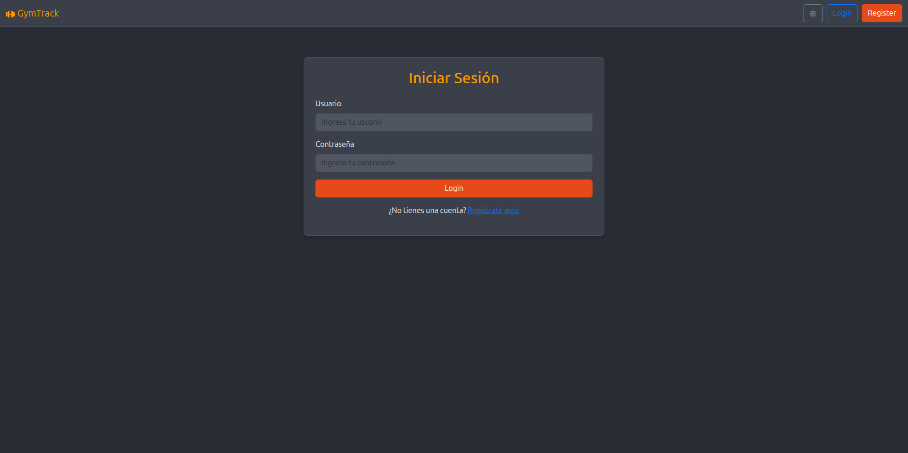
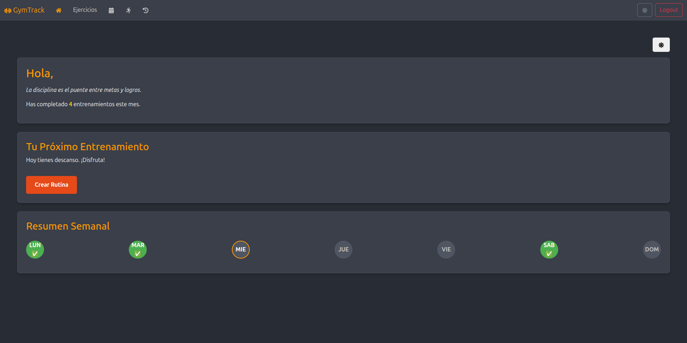
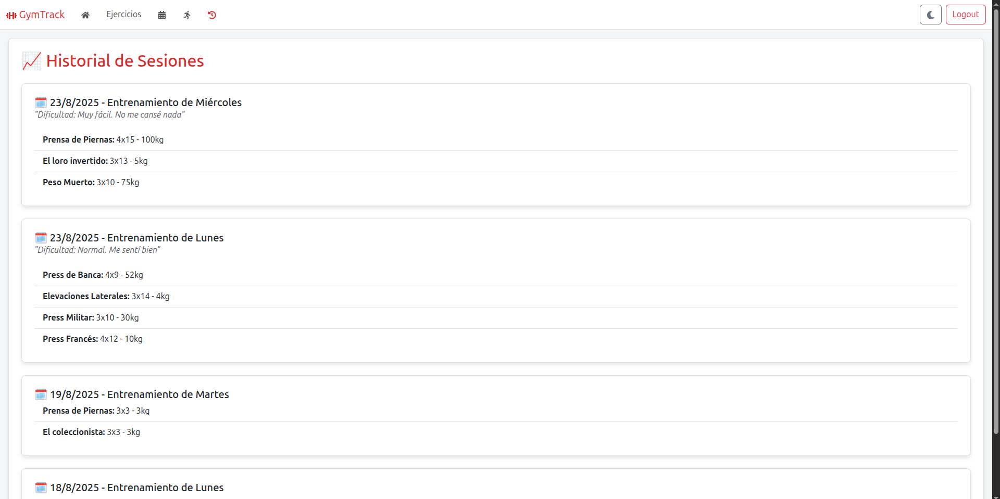
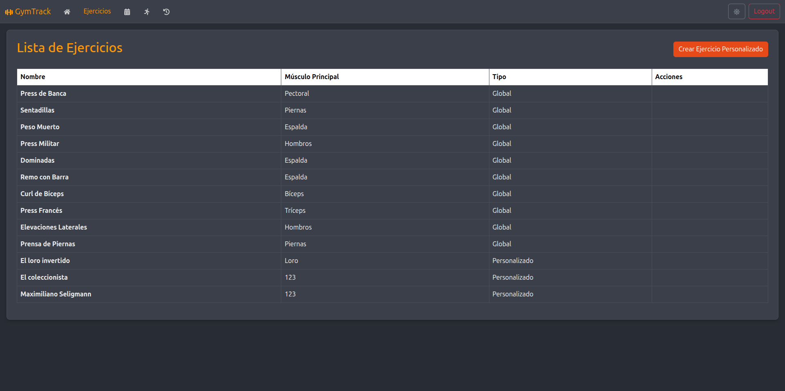
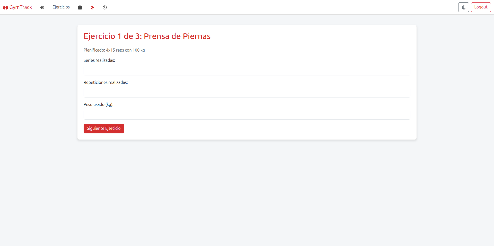
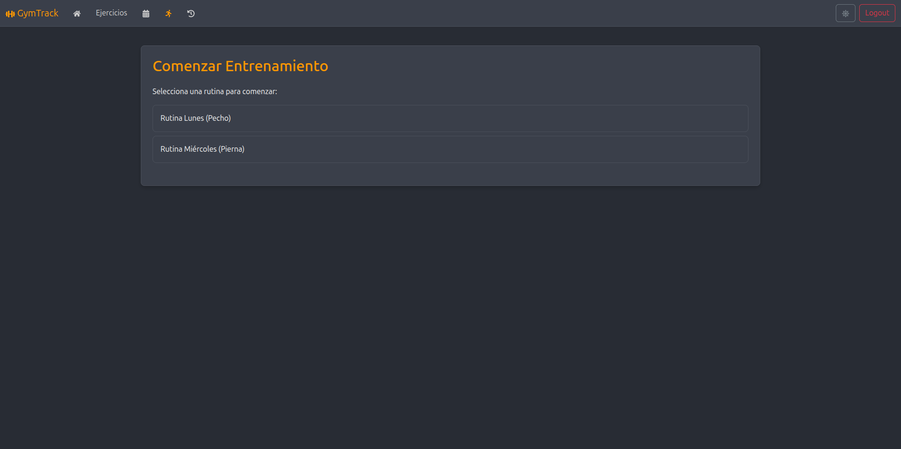

# GymTrack

<div align="center">
  <p>
    <strong>Una aplicación web para gestionar tus rutinas de gimnasio.</strong>
  </p>
  <p>
    Creada con Django REST Framework para el backend y React para el frontend.
  </p>
  <p>
    
    
  </p>
</div>

---

## 📝 Descripción

GymTrack es una herramienta completa que permite a los usuarios crear, gestionar y seguir sus rutinas de entrenamiento. La aplicación facilita la planificación semanal, el registro del progreso y la personalización de los ejercicios, todo a través de una interfaz limpia e intuitiva.

---

## ✨ Funcionalidades principales

- **Gestión de ejercicios:** Crea, modifica y elimina ejercicios de tu biblioteca personal.
- **Rutinas personalizadas:** Diseña tus propias rutinas de entrenamiento adaptadas a tus objetivos.
- **Seguimiento de progreso:** Registra tus sesiones diarias y visualiza tu historial para ver tu evolución.
- **Planificación semanal:** Organiza tu semana de entrenamiento y consulta tu plan de un vistazo.

---

<details>
  <summary>📸 Ver capturas de pantalla</summary>
  <br>
  
  <p align="center">
    
    <br><em>Vista principal de la aplicación.</em><br><br>
    
    <br><em>Dashboard del usuario.</em><br><br>
    
    <br><em>Plan semanal de entrenamiento.</em><br><br>
    
    <br><em>Historial y progreso.</em><br><br>
    
    <br><em>Lista de ejercicios.</em><br><br>
    
    <br><em>Ejercicio en entrenamiento.</em><br><br>
    
    <br><em>Comienzo de entrenamiento.</em><br><br>
  </p>
</details>

---

## 🛠️ Tecnologías utilizadas

- **Backend:** Django, Django REST Framework
- **Frontend:** React
- **Comunicación:** API REST

---

## 🚀 Instalación y uso

Sigue estos pasos para levantar el proyecto en tu entorno local.

### **Backend**

```bash
cd backend
python -m venv env
source env/bin/activate  # En Windows: env\Scripts\activate
pip install -r requirements.txt
python manage.py migrate
python manage.py runserver
```

### **Frontend**

```bash
cd frontend
npm install
npm start
```

Una vez que ambos servidores estén corriendo:

1.  Abre tu navegador y ve a `http://localhost:3000`.
2.  Navega entre las diferentes secciones para gestionar tus ejercicios, planes y progreso.

---

## 🤝 Contribuciones

¡Las contribuciones son siempre bienvenidas! Si tienes ideas para mejorar el proyecto, no dudes en abrir un _issue_ para discutirlo o enviar un _pull request_ con tus cambios.

---

## 📄 Licencia

Este proyecto está bajo la [Licencia MIT](LICENSE).

---

## 👨‍💻 Autor

- **Maximiliano Seligmann**
